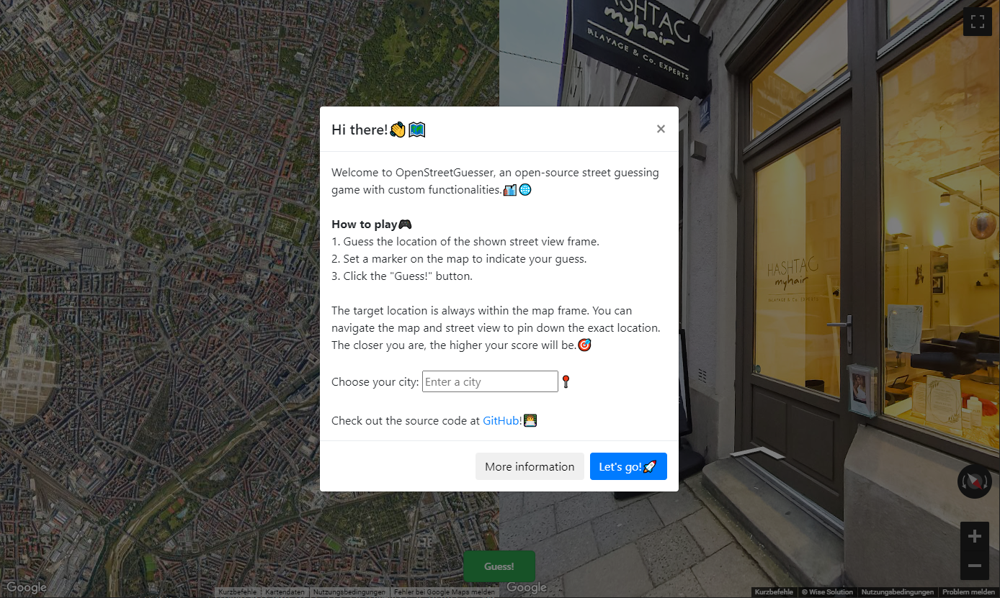

# OpenStreetGuesser

OpenStreetGuesser is an open-source street view guessing game clone with the goal of being highly customizable and easy to set up for self-hosting. Try it out on [https://louisdev.de/openstreetguesser](https://louisdev.de/openstreetguesser)!🗺

## Google Maps API Key

This project requires your own Google Maps API key in order to work. Once you have it, simply replace it in the js/config.js file.

Hosting this source code will expose your Google Maps API key, which is unavoidable. To prevent unauthorized use of your API key, you can set up [API key restrictions](https://developers.google.com/maps/documentation/javascript/get-api-key#restrict_key) to restrict the access to a specific domain of your choice. I already tried avoiding this by using a backend proxy server, but I noticed that even in the response data from Google, the API key is still included. If you have any ideas on how to prevent this, feel free to submit a pull request.

## Todo

- Switch metric / imperial units
- Countdown timer
- Adjust map radius slider
- Fix mobile view

## Credits

OpenStreetGuesser is created and maintained by [louis-e].
Contributions to OpenStreetGuesser are welcome! If you find any issues or have ideas for improvements, feel free to open an issue or submit a pull request.

## License

This project is licensed under the MIT License. See the [LICENSE](LICENSE) file for details.
